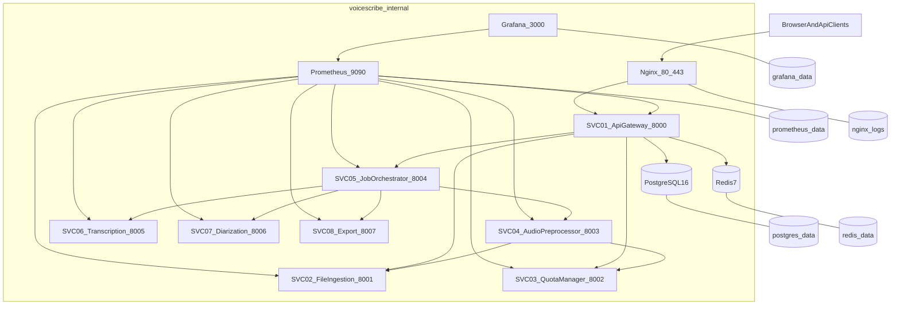

# Architettura Infrastruttura VoiceScribe

Questo repository fornisce l'infrastruttura condivisa per gli 8 microservizi VoiceScribe AI in modello polyrepo.

## Componenti
- Nginx: ingresso pubblico unico su `80/443`.
- PostgreSQL 16: stato persistente (`tenants`, `jobs`, `free_tier_usage`).
- Redis 7: broker Celery, quota cache, pub/sub.
- Prometheus: scraping metriche e alerting.
- Grafana: dashboard osservabilita provisioning-as-code.

## Networking e porte
- Pubbliche: `80`, `443` (solo Nginx).
- Interne Docker: PostgreSQL `5432`, Redis `6379`, Prometheus `9090`, Grafana `3000`.

## Volumi persistenti
- `postgres_data`
- `redis_data`
- `prometheus_data`
- `grafana_data`
- `nginx_logs`

## Diagramma Mermaid



## Pattern di comunicazione

| Pattern | Servizi | Esempio |
|--------|---------|---------|
| REST sincrono | SVC-01 → SVC-02, SVC-03, SVC-05 | Upload file, check quota, dispatch job |
| Celery asincrono | SVC-05 → SVC-04, SVC-06, SVC-07, SVC-08 | Task preprocessing, transcription, diarization, export |
| Redis pub/sub | SVC-05, SVC-08 → SVC-01 | `job:{id}:status` per WebSocket real-time |

## State machine job

```
QUEUED → PREPROCESSING → TRANSCRIBING → [DIARIZING] → EXPORTING → DONE
   |            |               |              |             |
   └────────────┴───────────────┴──────────────┴─────────────┴──→ FAILED
                                                                      |
                                                                      └→ QUEUED (retry)
```

- **DIARIZING**: solo per tier PRO/Enterprise.
- **FAILED**: da qualsiasi stato; retry riporta a QUEUED.

## Decisioni architetturali

1. **Nginx come unico ingresso**: riduce superficie d'attacco, centralizza TLS e rate limiting.
2. **Celery per pipeline**: job lunghi (minuti) non bloccano HTTP; retry e priorità per tier.
3. **Redis pub/sub per WebSocket**: SVC-01 non polla il DB; aggiornamenti real-time al client.
4. **Ramdisk per audio temporaneo**: I/O veloce per preprocessing e inference GPU.
